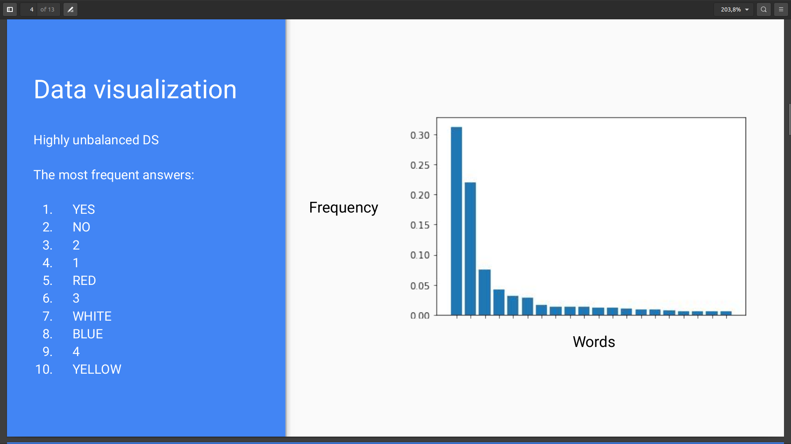
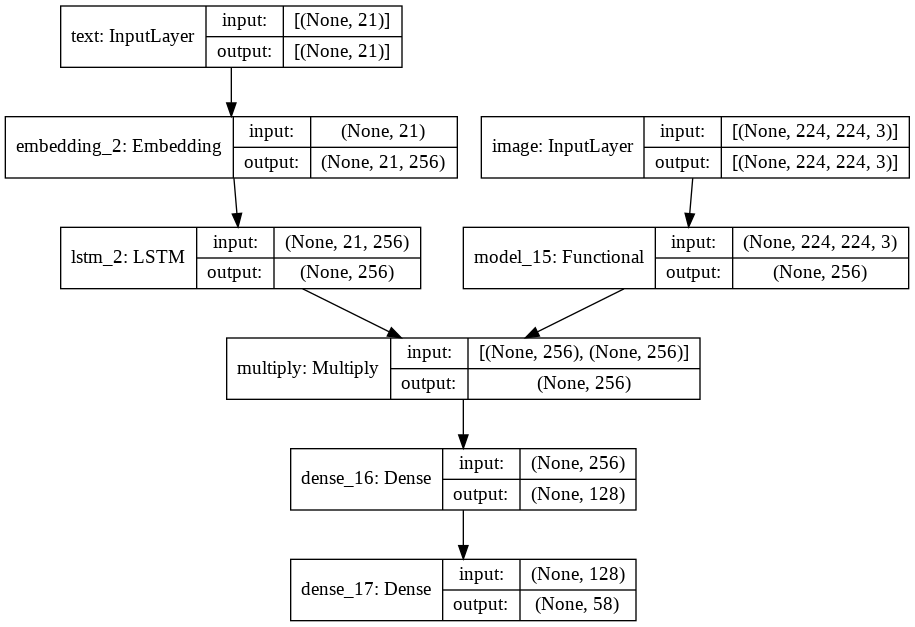

## We will go through all the choices made during this challenge

### Data Analysis
We started by analyzing the data. We observed that the dataset had a very strong bias
towards yes/no answers, in fact more than the 30% of them were “yes”, while about 23%
were “no”.

### Baseline Most Frequent Class
After analysing the data, we decided to start with a very simple baseline model which would
always predict “yes” as an answer, being it the most frequent one. This idea works well
under the assumption that the test data have the same distribution as the train data. The
baseline with the most frequent class achieved a performance of 0.29 on the test set. The
high bias on the training set is confirmed also on the test set.

### First Model 
After the basic baseline, we moved towards a true Deep Learning model. We started from a
very simple model since we wanted to proceed in an iterative way. This approach is fundamental to discover and fix
bugs in the data pipeline. Since the dataset is composed of tuples of questions and images, our
model had to work with two inputs.We transformed the images and the questions in their
latent representation individually. For the images, we used a classical CNN, with only convolutions and
maxPool layers, while for the questions we used a trainable embedding layer followed by a
single LSTM layer. We then concatenated the 2 vectors. A final classifier (multi layer perceptron) performs the final classification
of the answers. 
The accuracy on the test set was about 0.50156.

### GloVe
In order to improve model performance, we tried to use a pre-trained word embedding. We
opted for GloVe embedding. The size of the embedding chosen is 100 tokens.
We were able to improve the accuracy, reaching a value of 0.52228.

### Overfitting problem
We noticed an overfitting behavior since after a few epochs
the validation error started to grow without following the training error.
We tried different techniques to overcome this issue such as weight decay, dropout and
batch normalization. At the end the best performances were achieved by a dropout layer
after each layer with a probability of 0.22.
Batch normalization and dropout together were highly unstable instead.
The accuracy on the test set was about 0.60153.

### Transfer Learning 
After trying different techniques to reduce overfitting we decided to use a different Conv Net
model. We used a pre-trained MobileNet v2 from the keras applications and we applied the
principles of transfer learning. We freezed all the MobileNet layers and removed the top
classifier. We added a GAP and then a dense layer with 256 units. The latent representation
of the image was a vector of 256 elements, the exact same dimension of the ‘questions’
vector after the LSTM.
Instead of concatenating the 2 vectors we tried a different approach by performing a point
wise multiplication. Finally we put a classifier composed of 2 dense layers, one hidden layer
and one output ‘softmax’ layer.
We used a dropout layer after each fully connected layer and also after the LSTM module.
The performances were around 0.64 in the test set.
Given the good performances we tried different pre-trained networks like ResNet or VGG.
Unfortunately none of the networks achieved the same performances of Mobile Net V2.
